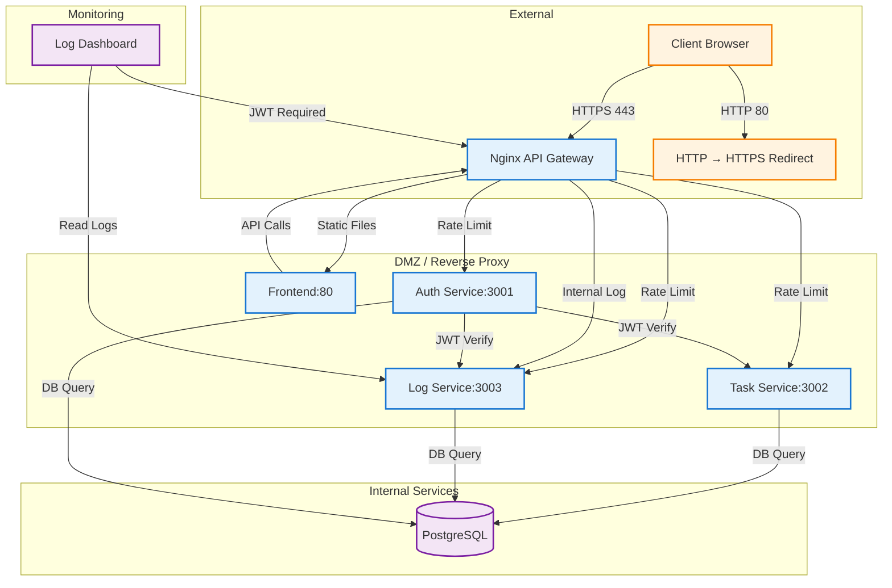

# รายชื่อสมาชิก
**66543206052-3 นางสาววชิรานีย์ ประเสริฐศรี**
**66543206094-5 นายอานุภาพ เฑียรประยูร**

## Architecture diagram

## การติดตั้งและใช้งาน

### ขั้นตอนการติดตั้ง

1. **ดาวน์โหลดโปรเจค**
   ```bash
   git clone <repository-url>
   cd finallab
   ```

2. **ตั้งค่า Environment Variables**
   ```bash
   cp .env.example .env
   ```
   
   แก้ไขไฟล์ `.env` ตามต้องการ (สามารถใช้ค่า default ได้)

3. **สร้าง SSL Certificate สำหรับ development**
   ```bash
   ./scripts/gen-certs.sh
   ```
   
   คำสั่งนี้จะสร้าง self-signed certificate ใน `nginx/certs/`

4. **รันด้วย Docker Compose**
   ```bash
   docker-compose up -d
   ```

5. **รอสักครู่ให้บริการทั้งหมดขึ้น**
   ```bash
   # ตรวจสอบสถานะ
   docker-compose ps
   
   # ดู log ถ้าต้องการ
   docker-compose logs -f
   ```

6. **เข้าใช้งาน**
   - เปิดเบราว์เซอร์ไปที่: `https://localhost`
   - ระบบจะ redirect อัตโนมัติจาก HTTP ไป HTTPS

### ข้อมูลเข้าสู่ระบบเริ่มต้น

| ผู้ใช้ | อีเมล | รหัสผ่าน | Role |
|--------|--------|----------|------|
| Alice | alice@example.com | password123 | member |
| Admin | admin@example.com | password123 | admin |

## 🔒 HTTPS และ Security Flow

### TLS Termination ที่ Nginx

```
Client HTTPS Request
        ↓
    Nginx (Port 443)
        ↓ (TLS terminated here)
    Internal HTTP to Services
```

- **TLS termination** เกิดที่ Nginx ทำให้ services ภายในสามารถใช้ HTTP ได้
- **Certificate**: Self-signed สำหรับ development (สามารถเปลี่ยนเป็น certificate จริงได้)
- **Protocols**: TLS 1.2 และ 1.3 เท่านั้น

### HTTP → HTTPS Redirect

```nginx
server {
    listen 80;
    server_name localhost;
    return 301 https://$host$request_uri;
}
```

- ทุกการเข้าถึง HTTP (port 80) จะถูก redirect ไป HTTPS (port 443) อัตโนมัติ

## 🔧 การพัฒนาและ Debug

### ดู log ของแต่ละ service
```bash
# ดู log ทั้งหมด
docker-compose logs -f

# ดู log ของ service เดียว
docker-compose logs -f auth-service
docker-compose logs -f task-service
docker-compose logs -f log-service
```

### ทดสอบ API ด้วย curl

**1. ขอ token ก่อน:**
```bash
TOKEN=$(curl -s -X POST https://localhost/api/auth/login \
  -H "Content-Type: application/json" \
  -d '{"email":"alice@example.com","password":"password123"}' | jq -r .token)
```

**2. ใช้ token กับ API:**
```bash
curl -H "Authorization: Bearer $TOKEN" https://localhost/api/tasks/
```